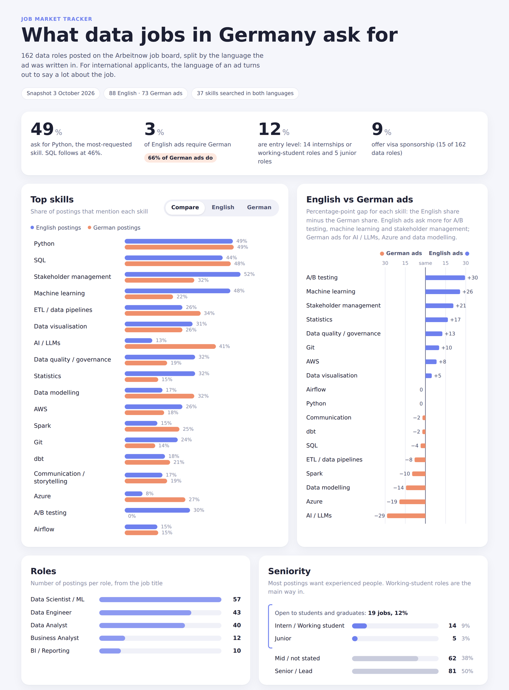

# Data Jobs in Germany

**What do data jobs in Germany ask for, and how open are they to international graduates?**

A weekly, automated tracker of data analyst, data scientist, data engineer and BI job postings in Germany. It collects postings from two job APIs, searches the full text for 37 skills in English and German, and compares ads written in English with ads written in German. That comparison answers practical questions for international applicants: which jobs need German, which skills each group of employers asks for, and how many roles are open at entry level.

**[Open the live dashboard](https://grey082005.github.io/data-jobs-germany/)**, rebuilt from the data every Monday.



## Key findings

Snapshot of 3 October 2026: 162 data roles from Arbeitnow (88 English ads, 73 German ads, 1 undetermined).

| Finding | Number |
|---|---|
| German required in **German-language** ads | **66%** (48 of 73) |
| German required in **English-language** ads | **3%** (3 of 88) |
| Ads that ask for Python / SQL | 49% / 46% |
| Entry-level roles (internship, working student, junior) | 12% (19 of 162) |
| Data roles offering visa sponsorship | 9% (15 of 162) |

1. **The language of an ad is a reliable signal for the language of the job.** Ads written in English almost never require German.
2. **Python and SQL are the baseline.** Both groups ask for them at nearly the same rate.
3. **The two groups ask for different extras.** English ads ask more often for A/B testing (+30 percentage points), machine learning (+26), stakeholder management (+21) and statistics (+17). German ads ask more often for AI/LLMs (+29), Azure (+19) and data modelling (+14).
4. **Entry-level roles are scarce.** Half of all ads are senior or lead roles. Working-student roles are the main way in.

These are measured differences between two groups of ads. Why they differ (for example, the type of company behind each group) is not measured here.

## How it works

```
Arbeitnow API ──┐                                         ┌─> history/skill_history.csv ──┐
 (full text)    ├─> fetch ─> language ─> skills, role ────┤                               ├─> docs/index.html
Adzuna API ─────┘            (de / en)    and level       └─> history/market_history.csv ─┘   (public dashboard)
 (counts, salaries)
```

| Step | Script | What it does |
|---|---|---|
| 1 | `fetch_arbeitnow.py` | Collects postings with full descriptions from the [Arbeitnow API](https://www.arbeitnow.com/blog/job-board-api), keeps data roles, marks visa sponsorship |
| 1b | `fetch_jobs.py` | Collects postings from the [Adzuna API](https://developer.adzuna.com/) for market size and location |
| 2 | `extract_skills.py` | Searches each description for 37 skills plus German and English language requirements, using English and German patterns (e.g. *statistics* / *Statistik*), and sorts each job into a role and a seniority level |
| 3 | `update_history.py` | Appends the week's summary numbers to `history/`, replacing a snapshot if the same date runs twice |
| 4 | `build_dashboard.py` | Fills `dashboard/template.html` with the latest snapshot and writes `docs/index.html` |
| all | `pipeline.py` | Runs steps 1 to 3 in order |
| extra | `make_charts.py` | Draws a static PNG version of the skill comparison |

**Automation:** a GitHub Actions workflow (`.github/workflows/weekly.yml`) runs every Monday. It runs the tests, then the pipeline, rebuilds the dashboard and commits the new numbers. Only summary numbers are stored in the repository, never the job ads themselves. Raw data is kept as a private workflow artifact for 90 days.

**Tests:** `tests/test_rules.py` checks language detection, skill matching in both languages (including edge cases such as "R" versus "R&D"), and the role and level rules. Run them with `python -m pytest`.

## Data decisions and limitations

- **Why two sources:** Adzuna's API returns only the first 500 characters of each description, which is usually the company introduction. In a first Adzuna sample, SQL appeared in only 3 of 297 postings. Arbeitnow returns full descriptions (about 5,000 characters on average), so skills are counted from Arbeitnow and Adzuna is used for market size.
- **Coverage:** Arbeitnow leans towards tech companies and startups that use applicant tracking systems such as Greenhouse. It is not the whole German market.
- **Language detection** counts common German and English words. In the first runs it left fewer than 1% of postings undetermined.
- **Skill matching** is rule-based, so it only finds the skills on the list and can miss unusual wording. The next step measures this against hand-labelled postings.
- **Seniority** comes from the job title. Ads without a level in the title count as "mid / not stated".
- **Postings change daily**, so two runs on the same day can differ slightly. The history keeps one snapshot per date.

## Roadmap

- [x] Two data sources, language detection, bilingual skill extraction
- [x] Weekly automated collection with history
- [x] Dashboard generated from the data, published with GitHub Pages
- [x] Tests for the text rules
- [ ] Trends over time once there are 4+ weekly snapshots
- [ ] LLM skill extraction, evaluated against the rules on 50 hand-labelled postings (precision, recall, F1)
- [ ] Model which factors predict entry-level access and visa sponsorship
- [ ] Skill-gap tool: compare a CV with current demand

## Run it yourself

```bash
pip install -r requirements.txt
python -m pytest            # check the rules
python pipeline.py          # collect, extract, update history
python build_dashboard.py   # rebuild docs/index.html
```

Adzuna is optional and needs a free key from [developer.adzuna.com](https://developer.adzuna.com/). Copy `.env.example` to `.env` and add the key. Without it the pipeline skips Adzuna and still runs.

Built with Python (pandas, requests, regular expressions, pytest), HTML/CSS/JavaScript and GitHub Actions.
